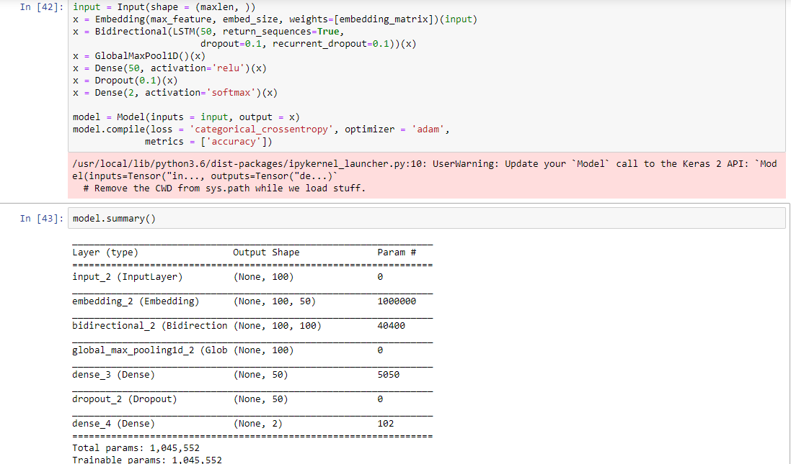
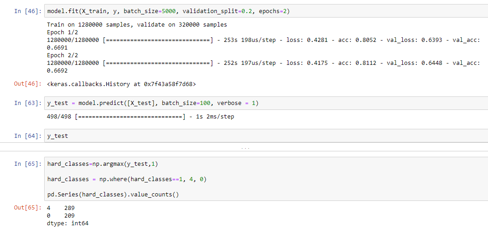

# Tweet Analysis

### Problem Statement:
We have dataset consists of large no. of tweets(text) along with sentiments(0=negative, 2=neutral, 4=positive).
### Solution:
We need a Classifier that can predict sentiments using data in training set.
### Column names:
1. polarity (sentiments)  
2. tweet id  
3. tweet date  
4. query  
5. user  
6. tweet (text)  

### Dataset dimension:
train_df.shape = (1600000, 6)  
test_df.shape = (498, 6)

***we have only two classes present in our output that is 0 --> negative & 4 --> positive.  
So, predicting 2 --> neutral sentiment in test data is not possible***

### Data Preprocessing:
Data Preprocessing steps are as follows :-
1. Removing html tags and other links available in tweets  
2. Removing numbers.  
3. changing letters from capitals to lowers  
4. Removing of Stopwords  
5. Making every tweet in to a meaningful tweet which computer can understand well (by tokenizing each word  

***Due to large training dataset Data Preprocessing is very time consumption as well as memory constraint for my Machine. This seems to be very challenging part for me. Well i decided to not for go data preprocessing, instead i will use one of the pretraining word embedding file called Glove. In this file each word is pretrained and has its coefficients. But, Glove don't have embedding matrix. So i will create it manually.***

### Model:
In this project i'm using Bi-directional LSTM model to get best prediction with out any data cleaning.

### Model Summary:
Choosed batch_size 5000 in oder to make by fitting process faster. considered only 2 ephocs bcoz from 3rd ephoc model is overfitting.

### Accuracy:
Model with bit tuning can manage to hit an accuracy of 60 % without any data cleaning.
***Performing all Data Preprocessing steps can definitely give best results***

